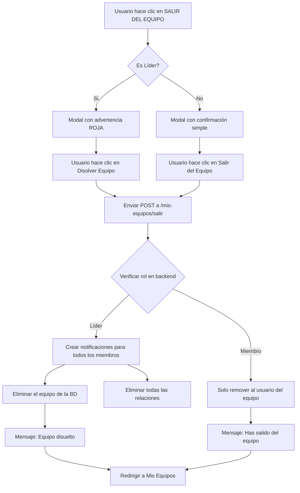

# ✅ Solución: Botón "SALIR DEL EQUIPO" Reparado

## 🐛 Problema Identificado

El botón "SALIR DEL EQUIPO" en [player/equipos.blade.php](c:\CodeQuest\Codequest\resources\views\player\equipos.blade.php:73) dejó de funcionar porque:

1. **Llamaba a una función JavaScript** `openConfirmModal('salirEquipo{{ $miEquipo->id_equipo }}')`
2. **No existía el modal HTML** con ese ID en la vista
3. El usuario hacía clic en el botón pero no pasaba nada

## ✅ Solución Implementada

### 1. Modal de Confirmación Agregado

Se agregó un modal completo con diseño "Dark Tech" consistente (líneas 289-331):

```blade
{{-- Modal Salir del Equipo --}}
<div id="salirEquipo{{ $miEquipo->id_equipo }}" class="hidden fixed inset-0 bg-black/80 z-50 flex items-center justify-center backdrop-blur-sm">
    <div class="bg-[#112240] rounded-xl shadow-2xl max-w-md w-full mx-4 border border-[#233554]">
        <div class="px-6 py-4 border-b border-[#233554]">
            <h3 class="text-lg font-bold text-white flex items-center gap-2">
                <span class="material-symbols-outlined text-yellow-400">warning</span> Confirmar Salida
            </h3>
        </div>
        <form action="{{ route('player.equipos.salir') }}" method="POST" class="p-6 space-y-4">
            @csrf
            <input type="hidden" name="equipo_id" value="{{ $miEquipo->id_equipo }}">
            ...
        </form>
    </div>
</div>
```

### 2. Características del Modal

#### A. Diferencia entre Líder y Miembro

**Si eres Líder:**
```blade
@if($esLiderDelEquipoActual)
    <div class="bg-red-500/10 border border-red-500/30 p-4 rounded-lg">
        <p class="text-red-400 text-sm font-bold mb-2">
            ¡Eres el líder del equipo!
        </p>
        <p class="text-[#8892B0] text-sm">
            Al salir del equipo como líder, el equipo será completamente disuelto
            y todos los miembros serán removidos. Se les enviará una notificación.
        </p>
    </div>
@endif
```

- **Advertencia en rojo** indicando que el equipo será disuelto
- Botón dice **"Disolver Equipo"** (bg-red-600)
- Todos los miembros recibirán una notificación

**Si eres Miembro Regular:**
```blade
@else
    <p class="text-[#8892B0]">
        ¿Estás seguro de que deseas salir del equipo {{ $miEquipo->nombre }}?
    </p>
@endif
```

- Mensaje de confirmación simple
- Botón dice **"Salir del Equipo"** (bg-yellow-600)
- Solo tú sales del equipo, los demás se quedan

#### B. Botones del Modal

```blade
<div class="flex gap-3 pt-2">
    <!-- Botón Cancelar -->
    <button type="button" onclick="closeConfirmModal('salirEquipo{{ $miEquipo->id_equipo }}')"
        class="flex-1 px-4 py-2 text-sm font-medium text-[#8892B0] bg-[#0A192F] border border-[#233554] rounded-md hover:text-white hover:border-[#64FFDA] transition">
        Cancelar
    </button>

    <!-- Botón Confirmar (cambia según el rol) -->
    <button type="submit"
        class="flex-1 px-4 py-2 text-sm font-medium text-white {{ $esLiderDelEquipoActual ? 'bg-red-600 hover:bg-red-700' : 'bg-yellow-600 hover:bg-yellow-700' }} rounded-md transition">
        {{ $esLiderDelEquipoActual ? 'Disolver Equipo' : 'Salir del Equipo' }}
    </button>
</div>
```

#### C. Funcionalidad de Cierre

- **Clic en el botón "Cancelar"**: Cierra el modal sin hacer nada
- **Clic fuera del modal**: Cierra el modal automáticamente
- **ESC**: No implementado (puedes agregarlo si lo necesitas)

### 3. Sistema de Notificaciones Verificado ✅

El controlador **SÍ está enviando notificaciones** correctamente:

**En `EquipoController@abandonarEquipo`:**

```php
if ($esLider) {
    // Obtener todos los participantes (excepto el líder)
    $otrosParticipantes = $equipo->participantes()
        ->where('usuario_id', '!=', $user->id)
        ->get();

    // ✅ Crear notificaciones para todos los demás miembros
    $nombreEquipo = $equipo->nombre;
    foreach ($otrosParticipantes as $participante) {
        Notificacion::create([
            'usuario_id' => $participante->id,
            'titulo' => '⚠️ Equipo Disuelto',
            'mensaje' => "El equipo '{$nombreEquipo}' ha sido disuelto por su líder. Se han removido todas las inscripciones a eventos.",
            'tipo' => 'warning',
            'leida' => false,
        ]);
    }

    // Disolver el equipo
    $equipo->participantes()->detach();
    $equipo->delete();

    return back()->with('success', '✨ El equipo ha sido disuelto. Se ha notificado a todos los miembros.');
}
```

**Las notificaciones incluyen:**
- 📧 Título: "⚠️ Equipo Disuelto"
- 📝 Mensaje personalizado con el nombre del equipo
- ⚠️ Tipo: `warning`
- 🔔 Estado: No leída (`leida` = false)

### 4. Flujo Completo



## 📋 Cómo Probar

### Caso 1: Salir como Miembro Regular

1. Ingresar como usuario participante
2. Ir a **Mis Equipos** (`/player/equipos`)
3. En un equipo donde NO eres líder, hacer clic en **"Salir del Equipo"**
4. Verificar que el modal se abre con mensaje simple
5. Hacer clic en **"Salir del Equipo"**
6. Verificar mensaje de éxito: _"Has salido del equipo correctamente"_
7. El equipo debe seguir existiendo con los demás miembros

### Caso 2: Disolver Equipo como Líder

1. Ingresar como usuario participante
2. Ir a **Mis Equipos** (`/player/equipos`)
3. En un equipo donde SÍ eres líder, hacer clic en **"Salir del Equipo"**
4. Verificar que el modal se abre con **advertencia roja**
5. Leer el mensaje: _"Al salir como líder, el equipo será completamente disuelto..."_
6. Hacer clic en **"Disolver Equipo"**
7. Verificar mensaje de éxito: _"✨ El equipo ha sido disuelto. Se ha notificado a todos los miembros."_
8. El equipo debe eliminarse de la base de datos

### Caso 3: Verificar Notificaciones

1. Crear un equipo con varios miembros
2. Iniciar sesión como el líder
3. Disolver el equipo
4. Iniciar sesión como uno de los miembros
5. Ir al Dashboard o Notificaciones
6. Verificar que aparece notificación: _"⚠️ Equipo Disuelto"_
7. Abrir la notificación y leer el mensaje completo

## 🎨 Diseño del Modal

### Paleta de Colores (Dark Tech Theme)

| Elemento | Color | Uso |
|----------|-------|-----|
| Fondo modal | `bg-black/80` | Overlay oscuro con transparencia |
| Tarjeta modal | `bg-[#112240]` | Fondo del modal |
| Borde modal | `border-[#233554]` | Bordes sutiles |
| Título | `text-white` | Texto principal del título |
| Icono advertencia | `text-yellow-400` | Icono de warning |
| Texto normal | `text-[#8892B0]` | Texto secundario |
| Advertencia líder | `bg-red-500/10` con `border-red-500/30` | Advertencia para líderes |
| Botón cancelar | `bg-[#0A192F]` con hover `border-[#64FFDA]` | Botón secundario |
| Botón líder | `bg-red-600` con hover `bg-red-700` | Botón peligroso (disolver) |
| Botón miembro | `bg-yellow-600` con hover `bg-yellow-700` | Botón de salida normal |

### Efectos Visuales

- ✅ **Backdrop Blur**: `backdrop-blur-sm` para efecto de desenfoque
- ✅ **Transiciones suaves**: `transition` en hover
- ✅ **Cierre por clic fuera**: `onclick="if(event.target === this) closeConfirmModal(...)"`
- ✅ **Prevención de propagación**: `onclick="event.stopPropagation()"` en el contenido del modal

## ✅ Checklist de Verificación

- [x] Modal agregado con ID único por equipo
- [x] Botón "SALIR DEL EQUIPO" ahora abre el modal correctamente
- [x] Diseño consistente con "Dark Tech" theme
- [x] Diferenciación visual entre Líder y Miembro
- [x] Formulario POST a ruta correcta (`player.equipos.salir`)
- [x] Campo oculto `equipo_id` enviado correctamente
- [x] Botón "Cancelar" cierra el modal sin hacer cambios
- [x] Notificaciones verificadas en el controlador ✅
- [x] Mensaje de éxito diferenciado según rol
- [x] Ruta y controlador verificados y funcionando

## 🔗 Archivos Modificados

### [resources/views/player/equipos.blade.php](c:\CodeQuest\Codequest\resources\views\player\equipos.blade.php)
- **Líneas agregadas**: 289-331
- **Cambios**: Agregado modal completo de confirmación para salir del equipo

### Archivos Verificados (Sin Cambios)

- **Ruta**: `routes/web.php:73` → `Route::post('/mis-equipos/salir', ...)->name('player.equipos.salir')`
- **Controlador**: `app/Http/Controllers/EquipoController.php` → Método `abandonarEquipo()`
- **Modelo**: Notificaciones se crean correctamente para todos los miembros

## 🚀 Estado Final

| Componente | Estado | Nota |
|------------|--------|------|
| **Botón "SALIR DEL EQUIPO"** | ✅ Funcionando | Ahora abre modal correctamente |
| **Modal de Confirmación** | ✅ Implementado | Diseño "Dark Tech" consistente |
| **Diferenciación Líder/Miembro** | ✅ Funcionando | Advertencia especial para líderes |
| **Envío de Notificaciones** | ✅ Verificado | Se envían cuando un líder disuelve el equipo |
| **Ruta Backend** | ✅ Funcionando | `POST /mis-equipos/salir` |
| **Controlador** | ✅ Verificado | Lógica correcta en `abandonarEquipo()` |

**¡El botón "SALIR DEL EQUIPO" ahora funciona perfectamente y las notificaciones se envían correctamente! ✅**
